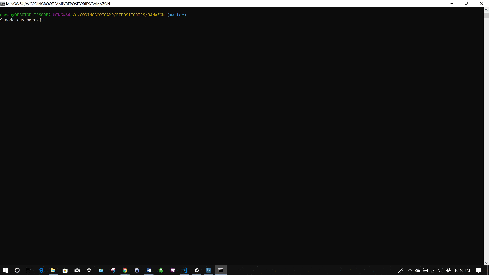
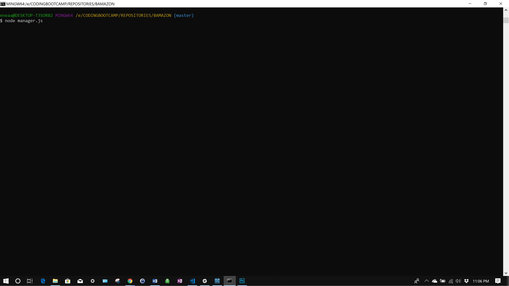
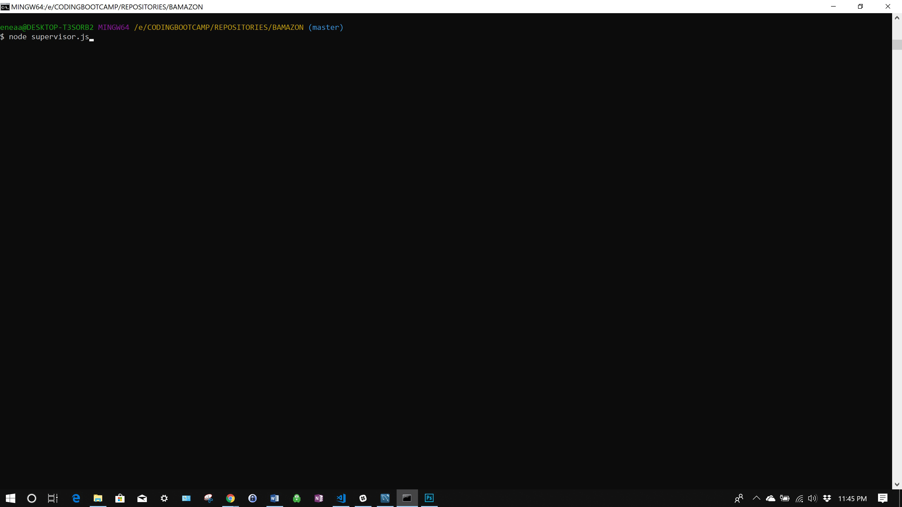

# BAMAZON - README
---
### Last Update: 8/25/2018
---

# CUSTOMER

### The customer module lets users view a current inventory of products, select a product to purchase, enter the quantity they wish to purchase, and then complete the purchase.

### The current inventory (stored in a SQL database) is then updated and can be viewed immediately with a new view call.

### The purchase function also aggregates the total product sales for a department and passes this value to department level stats. These stats can only be viewed with supervisory level clearance.

## To run this module in the terminal:

```node customer.js```



# MANAGER



# SUPERVISOR

